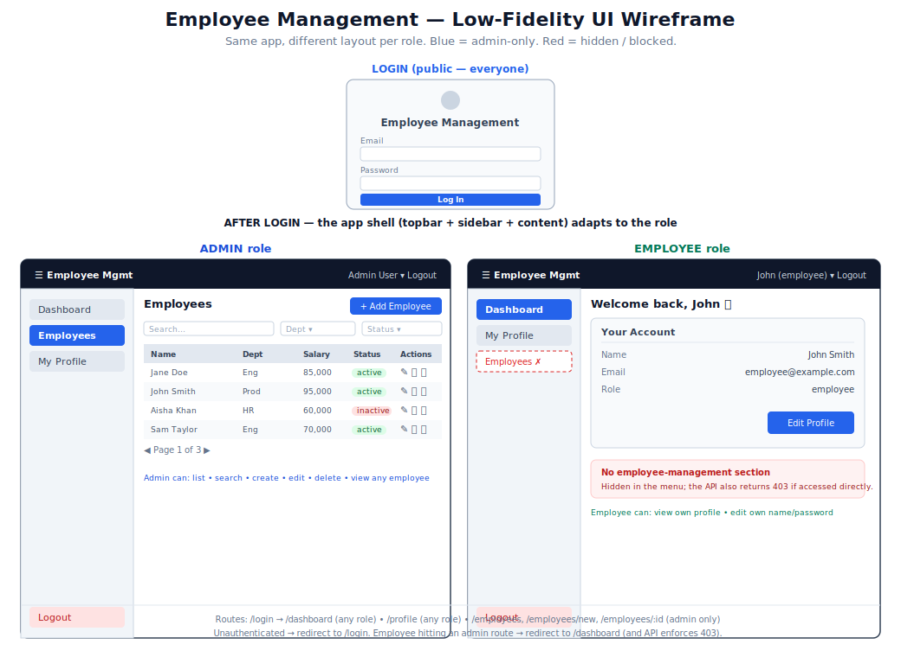

# UI Wireframe & Layout Schema (Low-Fidelity)

A structural blueprint for the React frontend: what screens exist, how the layout
looks, and **which role sees what**. This is intentionally low-fidelity — it defines
*structure and permissions*, not final visual design.

> Backend reference: [API.md](API.md) · Auth/CRUD examples: [README.md](README.md#react-integration-guide)



---

## 1. Screen inventory

| # | Screen | Route | Who can see it | Backend endpoint(s) |
|---|--------|-------|----------------|---------------------|
| 1 | Login | `/login` | Public | `POST /auth/login` |
| 2 | Dashboard | `/dashboard` | Admin + Employee (different content) | `GET /auth/me`, `GET /employees` (admin) |
| 3 | My Profile | `/profile` | Admin + Employee | `GET /auth/me`, `PUT /auth/me` |
| 4 | Employees List | `/employees` | **Admin only** | `GET /employees` |
| 5 | Employee Details | `/employees/:id` | **Admin only** | `GET /employees/:id` |
| 6 | Add Employee | `/employees/new` | **Admin only** | `POST /employees` |
| 7 | Edit Employee | `/employees/:id/edit` | **Admin only** | `PUT /employees/:id` |
| — | Delete employee | (action, not a page) | **Admin only** | `DELETE /employees/:id` |

---

## 2. The app shell (after login)

A persistent **topbar** + **sidebar**; the page content swaps based on the route.
The sidebar items shown depend on the logged-in user's `role`.

```
+--------------------------------------------------------------+
| [≡] Employee Mgmt                       Admin User ▾  Logout  |  <- Topbar (all roles)
+---------------+----------------------------------------------+
|               |                                              |
|  SIDEBAR      |   PAGE CONTENT                               |
|               |   (Dashboard / Employees / Profile / …)     |
|  Dashboard    |                                              |
|  Employees *  |                                              |
|  My Profile   |                                              |
|               |                                              |
|  Logout       |                                              |
+---------------+----------------------------------------------+
   * "Employees" appears for ADMIN only
```

**Sidebar by role:**

| Sidebar item | Admin | Employee |
|--------------|:-----:|:--------:|
| Dashboard    | ✅ | ✅ |
| Employees    | ✅ | ❌ (hidden) |
| My Profile   | ✅ | ✅ |
| Logout       | ✅ | ✅ |

---

## 3. Screen-by-screen wireframes

### 3.1 Login — `/login` (public)

```
+------------------------------------------+
|              [ Logo ]                     |
|          Employee Management              |
|                                           |
|   Email     [_________________________]   |
|   Password  [_________________________]   |
|                                           |
|             [      Log In      ]          |
|                                           |
|   (error message shows here on 401)       |
+------------------------------------------+
```
On success: store JWT → redirect to `/dashboard`.

---

### 3.2 Dashboard — `/dashboard`

**Admin sees stats + quick table:**
```
+----------------------------------------------------------+
|  Dashboard                                               |
|  +------------+ +------------+ +------------+             |
|  | Total: 24  | | Active: 20 | | Depts: 5   |   <- stats |
|  +------------+ +------------+ +------------+             |
|                                                          |
|  Recent Employees                      [ View all → ]    |
|  +----------------------------------------------------+  |
|  | Name      | Department | Status  |                 |  |
|  | Jane Doe  | Eng        | active  |                 |  |
|  | ...                                                |  |
|  +----------------------------------------------------+  |
+----------------------------------------------------------+
```

**Employee sees a personal summary only (no stats, no employee data):**
```
+----------------------------------------------------------+
|  Welcome back, John 👋                                    |
|  +----------------------------------------------------+  |
|  | Your Account                                       |  |
|  | Name : John Smith                                  |  |
|  | Email: employee@example.com                        |  |
|  | Role : employee                  [ Edit Profile ]  |  |
|  +----------------------------------------------------+  |
+----------------------------------------------------------+
```

---

### 3.3 My Profile — `/profile` (both roles)

```
+--------------------------------------------------+
|  My Profile                                      |
|                                                  |
|  Name      [ Admin User__________ ]   (editable) |
|  Email       admin@example.com        (read-only)|
|  Role        admin                    (read-only)|
|                                                  |
|  Change Password                                 |
|  New Password [____________________]  (optional) |
|                                                  |
|                            [ Save Changes ]      |
+--------------------------------------------------+
```
Maps to `PUT /auth/me` (only `name` and `password` are editable; email/role are not).

---

### 3.4 Employees List — `/employees` (admin only)

```
+-------------------------------------------------------------+
|  Employees                              [ + Add Employee ]  |
|                                                             |
|  Search [__________]   Dept [All ▾]   Status [All ▾]        |
|                                                             |
|  +-------------------------------------------------------+  |
|  | Name      | Email      | Dept | Salary | Status |Acts |  |
|  |-----------|------------|------|--------|--------|-----|  |
|  | Jane Doe  | jane@…     | Eng  | 85,000 | active |✎🗑👁|  |
|  | John Smith| john@…     | Prod | 95,000 | active |✎🗑👁|  |
|  | …                                                     |  |
|  +-------------------------------------------------------+  |
|                                                             |
|  ◀ Prev    Page 1 of 3    Next ▶                            |
+-------------------------------------------------------------+
```
- Search/filter → `GET /employees?search=&department=&status=&page=&limit=`
- ✎ edit → `/employees/:id/edit` · 🗑 delete → confirm modal → `DELETE` · 👁 view → `/employees/:id`

---

### 3.5 Add / Edit Employee — `/employees/new`, `/employees/:id/edit` (admin only)

```
+-------------------------------------------------------------+
|  Add Employee                          [ Cancel ] [ Save ]  |
|                                                             |
|  First Name [______________]   Last Name [______________]  |
|  Email      [____________________________________________] |
|  Phone      [______________]   Salary    [______________]  |
|  Designation[______________]   Department[______________]  |
|  Status     ( ) active    ( ) inactive                      |
|                                                             |
|  (field-level validation errors show under each input)      |
+-------------------------------------------------------------+
```
- Add → `POST /employees` (201) · Edit → `PUT /employees/:id` (200)
- `createdBy` is set by the server automatically — do **not** send it.

---

### 3.6 Employee Details — `/employees/:id` (admin only)

```
+--------------------------------------------------+
|  Jane Doe                      [ Edit ] [ Delete ]|
|  +--------------------------------------------+  |
|  | Email      : jane.doe@example.com          |  |
|  | Phone      : +1-202-555-0143               |  |
|  | Designation: Software Engineer             |  |
|  | Department : Engineering                   |  |
|  | Salary     : 85,000                        |  |
|  | Status     : active                        |  |
|  | Created by : Admin User                    |  |
|  +--------------------------------------------+  |
+--------------------------------------------------+
```

---

## 4. Role-based visibility matrix (what to display, to whom)

| UI element / action | Admin | Employee | If employee tries anyway |
|---------------------|:-----:|:--------:|--------------------------|
| Login               | ✅ | ✅ | — |
| Sidebar → Dashboard | ✅ | ✅ | — |
| Sidebar → Employees | ✅ | ❌ | item hidden |
| Sidebar → My Profile| ✅ | ✅ | — |
| Dashboard stats (totals) | ✅ | ❌ | not rendered |
| View employee table | ✅ | ❌ | route guard → redirect; API → `403` |
| "+ Add Employee" button | ✅ | ❌ | not rendered |
| Edit / Delete employee | ✅ | ❌ | not rendered; API → `403` |
| View own profile    | ✅ | ✅ | — |
| Edit own name/password | ✅ | ✅ | — |

> **Two layers of enforcement:** the UI *hides* what a role can't use (better UX),
> and the **API independently enforces** it (`401`/`403`) — never trust the client alone.

---

## 5. Routing structure (React Router v6)

```
<Routes>
  /login                         → LoginPage              (public)

  <ProtectedRoute>               (requires a valid token)
    /dashboard                   → DashboardPage          (admin + employee)
    /profile                     → ProfilePage            (admin + employee)

    <ProtectedRoute role="admin">
      /employees                 → EmployeeListPage       (admin only)
      /employees/new             → EmployeeFormPage       (admin only)
      /employees/:id             → EmployeeDetailsPage    (admin only)
      /employees/:id/edit        → EmployeeFormPage       (admin only)
    </ProtectedRoute>

  *  (any unknown route)         → redirect to /dashboard
```

**Access-control flow:**
```
            ┌─ no token ──────────────► redirect to /login
visit route ┤
            └─ has token ─► role ok? ─┬─ yes ─► render page
                                      └─ no  ─► redirect to /dashboard
                                               (and the API returns 403 anyway)
```

The `ProtectedRoute` component is sketched in [README.md](README.md#react-integration-guide).

---

## 6. Suggested component structure

```
src/
├── api/                  # axios instance + endpoint wrappers (see README)
│   ├── axios.js
│   ├── auth.js
│   └── employees.js
├── context/
│   └── AuthContext.jsx   # current user, token, login(), logout()
├── components/
│   ├── ProtectedRoute.jsx
│   ├── Layout.jsx        # topbar + role-aware sidebar + <Outlet/>
│   ├── Sidebar.jsx       # renders nav items based on user.role
│   ├── EmployeeTable.jsx
│   ├── EmployeeForm.jsx
│   └── ConfirmDialog.jsx # delete confirmation
└── pages/
    ├── LoginPage.jsx
    ├── DashboardPage.jsx
    ├── ProfilePage.jsx
    ├── EmployeeListPage.jsx
    ├── EmployeeDetailsPage.jsx
    └── EmployeeFormPage.jsx
```

**Role-aware sidebar (the core of "what to display to whom"):**
```jsx
const navItems = [
  { label: "Dashboard",  to: "/dashboard", roles: ["admin", "employee"] },
  { label: "Employees",  to: "/employees", roles: ["admin"] },
  { label: "My Profile", to: "/profile",   roles: ["admin", "employee"] },
];

// render only items whose `roles` includes the current user's role
navItems
  .filter((item) => item.roles.includes(user.role))
  .map((item) => <NavLink key={item.to} to={item.to}>{item.label}</NavLink>);
```

---

## 7. Reminder: `users` vs `employees`

- A **user** (`/auth/*`) is a **login account** with a `role`. Registering as `employee`
  creates a user account — it does **not** add a row to the employees list.
- An **employee** (`/employees/*`) is an **HR record** managed by admins.

So the **Employees** screens operate on HR records, while **My Profile** operates on the
logged-in user's own account. They are deliberately separate.
